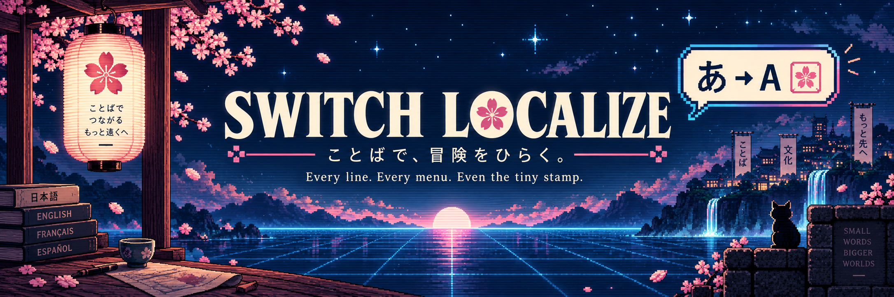
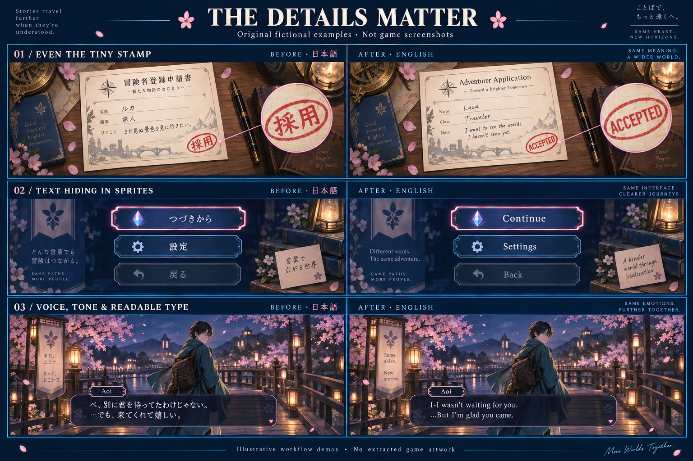
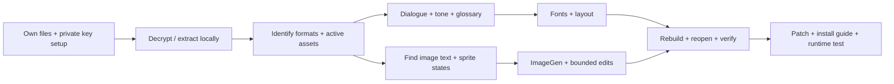

<div align="center">



# Switch Localize

**ことばで、冒険をひらく。**<br>
*Open the adventure through language.*

An agent skill for the whole fan-localization workflow:<br>
**private setup → extraction → dialogue → fonts → sprites → verified patch.**

[](https://skills.sh/phucledien/switch-localize-skill)
[](skills/switch-localize/SKILL.md)
[](skills/switch-localize/scripts)
[](LICENSE)

[Install](#-install) · [See the details](#-the-details-matter) · [Workflow](#-from-private-inputs-to-a-patch) · [Key setup](skills/switch-localize/references/private-inputs.md) · [Contribute](CONTRIBUTING.md)

</div>

---

## 🎮 What it does

Translating a script is only part of translating a game. This skill teaches an agent to look for the words players actually see: choices, names, save screens, selected buttons, tiny stamps, atlas sprites, startup notices, and captions hidden inside images.

It combines **editorial work**—voice, relationships, terminology and tone—with **format-aware engineering**—protected control codes, glyph coverage, texture geometry, round trips and repeatable builds.

English, Vietnamese, and other target languages are supported as workflows. Each game still needs its own format research and renderer checks. This is an agent playbook with two small Python helpers, not a universal decryptor or one-click translator.

## 🌸 The details matter



> **Original fictional demonstrations, generated for this repository.** These are not extracted game assets, actual game screenshots, or evidence of hardware compatibility. [Artwork provenance and prompts](docs/ARTWORK.md).

| Surface | What the agent should notice | What must survive |
| --- | --- | --- |
| Tiny stamp | `採用` → `ACCEPTED`, including its low-resolution in-game appearance | Ink texture, perspective, paper and surrounding art |
| Menu sprites | `つづきから` → `Continue`; `設定` → `Settings`; `戻る` → `Back` | Atlas coordinates, icons, alpha and every interaction state |
| Dialogue | Preserve the hesitant opening and softened admission, not just dictionary meanings | Speaker identity, story context, variables and line breaks |
| Fonts | Test the actual target corpus, including `Đ`, `ễ`, `ự` when translating Vietnamese | Diacritics, line height, readable wrapping and renderer behavior |

The fictional line `べ、別に君を待ってたわけじゃない。…でも、来てくれて嬉しい。` becomes **“I-I wasn't waiting for you. ...But I'm glad you came.”** The stammer and change of tone matter. A polished sentence that erases them can be a worse translation.

Image generation supplies candidate lettering or clean plates. The workflow still requires exact spelling checks, bounded compositing, re-encoding, reopening, and inspection at native resolution. A nice preview is not a validated game patch.

## 🚀 Install

With Node.js/npm installed, use the [Skills CLI](https://github.com/vercel-labs/skills):

```sh
npx skills add phucledien/switch-localize-skill --skill switch-localize
```

Choose your agent in the installer. For a global Codex installation:

```sh
npx skills add phucledien/switch-localize-skill --skill switch-localize --agent codex --global
```

List the discoverable skill without installing it:

```sh
npx skills add phucledien/switch-localize-skill --list
```

<details>
<summary>Manual installation / preserve an existing customized skill</summary>

Clone this repository, then copy **only** `skills/switch-localize/` into your agent's documented skill directory. Keep the folder name `switch-localize` and its `SKILL.md` intact. Do not copy game files into that directory.

If a customized version is already installed, compare and back it up before replacing anything. The public package can also be read or invoked by path without overwriting your private copy.

</details>

### Start a project

```text
Use $switch-localize to translate my game from Japanese to English.
My original files and any required keys are stored privately outside this repo.
Inspect the game/version and formats first. Cover dialogue, choices, names,
menus, HUD, image-based text and alternate states. Keep originals immutable.
Build a reproducible patch and report what has actually been tested.
```

Use your agent's skill invocation syntax if it differs. The helper scripts require **Python 3.9+**, with no third-party Python packages. Extraction, game-specific parsers, image editing and runtime testing require separate tools chosen for the actual project.

## 🗺️ From private inputs to a patch



| Stage | What happens |
| --- | --- |
| **01 · Prepare privately** | Identify console, game, region and version. Guide the user through a compatible own-device key-export route when needed; accept a local file path, never pasted keys. Already extracted RomFS can skip decryption. |
| **02 · Decrypt & inventory** | Use independently obtained local tools with the user's own inputs. Verify metadata and hashes; separate base/update/DLC; keep originals immutable. |
| **03 · Understand the game** | Inspect actual formats and prove an unchanged round trip. Trace active locales, duplicate archives, fallback assets and display-only fields. |
| **04 · Translate the story** | Work by scene, speaker and chronology. Maintain a glossary. Preserve variables, commands, choices and character voice; distinguish drafts from reviewed text. |
| **05 · Hunt hidden text** | Inspect texture atlases, sprites, tiny props, menus, HUD, controller guides, save/load, galleries and all interaction states. OCR is a discovery aid, not completion proof. |
| **06 · Localize images & fonts** | Generate exact lettering/clean plates, preserve geometry and art, check glyph coverage and measured layout, then inspect the serialized output. |
| **07 · Verify & deliver** | Reopen outputs, compare unchanged data, assemble the selected payload, hash it, and provide install/removal/rollback instructions. Report offline checks separately from console tests. |

Begin with [private inputs and extraction](skills/switch-localize/references/private-inputs.md). Continue with [image-text localization](skills/switch-localize/references/image-text.md) and [validation/release](skills/switch-localize/references/validation-release.md).

## 🧰 Inside the skill

```text
skills/switch-localize/
├── SKILL.md                 # Agent entry point
├── agents/openai.yaml       # Agent UI metadata
├── references/              # Private setup, formats, language, images, release
└── scripts/
    ├── inventory_assets.py  # Read-only inventory; optional SHA-256 hashes
    └── payload_manifest.py  # Create/verify a selected payload's file manifest
```

The inventory helper recognizes a few signatures; it does not identify every engine or prove that an asset is active. The manifest helper checks file identity; it does not prove translation quality, legality, completeness or console compatibility.

## 🔐 What stays private

**This repository contains instructions, generic helpers, and original demo art.** It contains no games, decryption keys, firmware, tickets, certificates, console backups, proprietary fonts, extracted sprites, dialogue dumps or ready-made commercial game patches.

Your game workspace belongs **outside this repository**. Keys belong outside both the repository and the game workspace's shareable outputs. Do not attach these materials to issues, pull requests, Actions artifacts or AI chats. Use synthetic fixtures for bug reports.

A local patch is not automatically suitable for redistribution. Binary deltas can still contain copyrighted material. Review each intended publication separately; neither a clean secret scan nor the MIT license grants rights to third-party content. No method can promise immunity from a legal complaint.

Nintendo and Nintendo Switch are trademarks of Nintendo. This independent project is not affiliated with or endorsed by Nintendo or any game publisher.

## 🛠️ Contribute

Format research, generic validators, clearer translation guidance and original synthetic tests are welcome. Read [CONTRIBUTING.md](CONTRIBUTING.md) and run:

```sh
python3 -m unittest discover -s tests -v
python3 tools/audit_public.py
```

[MIT license](LICENSE) covers this repository's contributed material to the extent the contributor can license it; third-party games, tools and fonts retain their own rights. Demo images are AI-generated and are not claimed as exclusive artwork.

